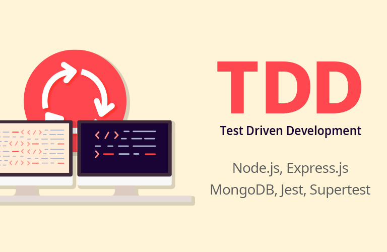

## 따라하며 배우는 TDD 개발

https://www.inflearn.com/course/%EB%94%B0%EB%9D%BC%ED%95%98%EB%A9%B0-%EB%B0%B0%EC%9A%B0%EB%8A%94-tdd/

### 목록
- [x] Jest 환경 이해하고 구성하기
- [x] Create 테스트 케이스 작성하기
- [x] Create 통합 테스트
- [x] read 단위 테스트
- [x] read 통합 테스트
- [x] update 단위 테스트
- [x] update 통합 테스트
- [x] delete 단위 테스트
- [x] delete 통합 테스트